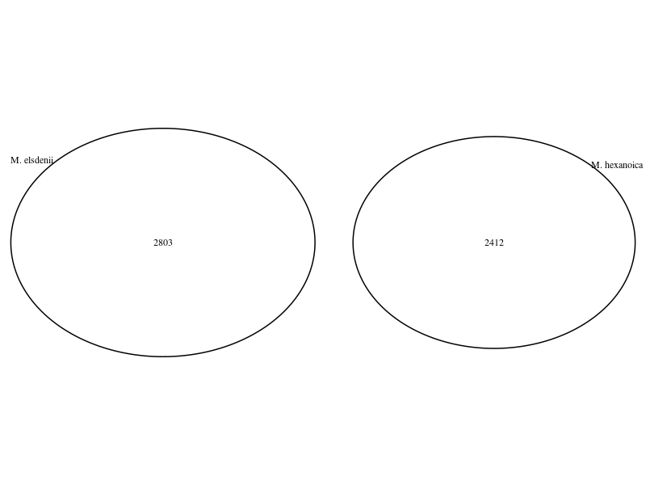

```{r setup, include=FALSE, message = FALSE, warning=FALSE, cache=FALSE}}
knitr::opts_chunk$set(echo = TRUE, results = 'asis')

library(tidyr)
library(dplyr)
library(readr)
library(ggplot2)
library(stats)
library(reshape2)
```

# import out count data rename the columns and import meta data

```{r}
raw_count_df <- read.table("~/cam_proj/A02_qiime/exported-table/feature-table.tsv", sep = "\t", header = FALSE)

colnames(raw_count_df)[1] <- "asv"
colnames(raw_count_df)[2] <- "F8S2P1T3P"
colnames(raw_count_df)[3] <- "F3S1P2T4F"
colnames(raw_count_df)[4] <- "F4S1P2T2F"
colnames(raw_count_df)[5] <- "F1S1P1T1F"


# import metadata
metadata <- read_csv2("~/cam_proj/metadata.csv")


# Gather the counts into a long format
raw_count_long_df <- raw_count_df %>%
  gather(accession, count, -asv)
  

#merge data
merged_df <- left_join(raw_count_long_df, metadata, by = "accession")

```

# Calculate relative abundance

```{r}
normalized_metrics_df <- raw_count_long_df %>%
  group_by(accession) %>% 
  mutate(total_count = sum(count),
         rel_abundance = (count / total_count) * 100) %>%
  ungroup() %>%
  
  # First, filter out rows where max(rel_abundance) is zero for an 'asv'
  group_by(asv) %>%
  filter(max(rel_abundance) != 0) %>%
  
  # Then, normalize 'rel_abundance' by max value for each 'asv'
  mutate(max_rel_abundance = max(rel_abundance),
         norm_rel_abundance = rel_abundance / max_rel_abundance) %>%
  ungroup() 


# Extract top 30 ASVs based on max_rel_abundance
top_30_asvs_df <- normalized_metrics_df %>%
  # Pick unique ASVs and their max_rel_abundance
  select(asv, max_rel_abundance) %>%
  distinct() %>%
  
  # Sort them in descending order of max_rel_abundance
  arrange(desc(max_rel_abundance)) %>%
  
  # Take the top 30
  slice_head(n = 30)


colnames(normalized_metrics_df)[2] <- "T.Group"
# filter our complete dataframe
normalized_metrics_top30_df <- normalized_metrics_df %>%
  filter(asv %in% top_30_asvs_df$asv) %>%
  arrange(T.Group, desc(norm_rel_abundance))


sorted_asvs <- normalized_metrics_top30_df %>%
  filter(norm_rel_abundance == 1) %>%
  group_by(asv) %>%
  summarize(earliest_time = min(T.Group)) %>%
  arrange(earliest_time, asv) %>%
  pull(asv)

sorted_asvs <- rev(sorted_asvs)

normalized_metrics_top30_df$asv <- factor(normalized_metrics_top30_df$asv, levels = sorted_asvs)
normalized_metrics_top30_df$T.Group <- as.factor(normalized_metrics_top30_df$T.Group
)

```

##### plotting

```{r}
ggplot(normalized_metrics_top30_df, aes(x = T.Group, y = asv, fill = norm_rel_abundance)) +
  
  geom_tile() +
  
  # Set the fill scale
  scale_fill_gradient(low = "black", high = "red") +
  
  # Set axis labels and title
  labs(x = "Time Point", y = "ASVs", fill = "Normalized Relative Abundance") +
  
  # Optional: Add additional styling elements like theme
  theme_minimal() +
  theme(
    axis.text.x = element_text(angle = 45, hjust = 1),
    axis.text.y = element_text(size = 8)
  )
```

# Perform the Kruskal-Wallis test

```{r}
kruskal_test_result <- normalized_metrics_top30_df %>%
  group_by(T.Group) %>%
  summarize(mean_rel_abundance = mean(norm_rel_abundance)) %>%
  kruskal.test(mean_rel_abundance ~ T.Group)


# Print the Kruskal-Wallis test result
print(kruskal_test_result)
```

#Kruskal-Wallis chi-squared = 5.3333, df = 1, p-value = 0.02092

# there are significant differences in the mean relative abundance of ASVs among the different time points. These differences may indicate that the composition of ASVs varies significantly as time progresses.

Perform ANOVA

```{r}
# Example data
data <- data.frame(
  Group = factor(rep(1:4, each = 25)),
  Value = rnorm(100)
)

# Perform one-way ANOVA
anova_result <- aov(Value ~ Group, data = data)

# Print the ANOVA table
summary(anova_result)
```

3.  Test if the mean relative abundance significantly differs across the
    groups. Provide the reason for the test used and the resulting
    p-value.

######ANSWER##### #The analysis of ASV data derived from bacterial
samples collected at multiple time points before and after feeding, with
composite data for each fermentor within their respective
fractionations, suggests the need for a robust statistical approach.
Given the potential non-normality of count data and the absence of
homogeneity of variances, the Kruskal-Wallis test is a suitable choice
to assess group differences.

Prokka Annotation:

```{r}
# Read the Prokka output file with colon-separated values
m.hexanoica <- read.delim("~/cam_proj/06_annotation_hexanoica/PROKKA_10062023.txt", sep = ":", header = TRUE)
# Read the Prokka output file with ":" as the delimiter
m.elsdenii <- read.delim("~/cam_proj/06_annotation_elsdenii/PROKKA_10062023.txt", sep = ":", header = TRUE)

m.hexanoica_info <- read_delim("~/cam_proj/06_annotation_hexanoica/PROKKA_10062023.tsv", delim = "\t", escape_double = FALSE, trim_ws = TRUE, skip = 1)

m.elsdenii_info <- read_delim("~/cam_proj/06_annotation_elsdenii/PROKKA_10062023.tsv", delim = "\t", escape_double = FALSE, trim_ws = TRUE, skip = 1)


# Create a bar chart for the number of contigs and bases
data <- data.frame(
  Genome = c("M. elsdenii", "M. hexanoica"),
  Contigs = c(1, 1),
  Bases = c(2566193, 2877851)
)

ggplot(data, aes(x = Genome, y = Bases, fill = Genome)) +
  geom_bar(stat = "identity") +
  labs(title = "Number of Contigs and Bases Comparison",
       x = "Genome",
       y = "Number of Bases") +
  scale_fill_manual(values = c("M. elsdenii" = "blue", "M. hexanoica" = "red")) +
  theme_minimal()
  
  
# Create a stacked bar chart for gene categories
gene_data <- data.frame(
  Genome = c("M. elsdenii", "M. hexanoica"),
  CDS = c(2324, 2730),
  tRNA = c(66, 54),
  rRNA = c(21, 18)
)

gene_data_long <- tidyr::gather(gene_data, Category, Count, -Genome)

ggplot(gene_data_long, aes(x = Genome, y = Count, fill = Category)) +
  geom_bar(stat = "identity") +
  labs(title = "Gene Categories Comparison",
       x = "Genome",
       y = "Number of Genes") +
  scale_fill_manual(values = c("CDS" = "blue", "tRNA" = "red", "rRNA" = "green")) +
  theme_minimal()
```

Venn Diagram

```{r}
# Load the necessary library for Venn diagrams
library(VennDiagram)

# Initialize an empty character vector for M. elsdenii gene IDs
genes_elsdenii <- character(0)

# Initialize an empty character vector for M. hexanoica gene IDs
genes_hexanoica <- character(0)
# Define the paths to the GFF files for each genome
gff_file_elsdenii <- "~/cam_proj/06_prokka_e/PROKKA_10092023.gff"
gff_file_hexanoica <- "~/cam_proj/06_prokka_h/PROKKA_10092023.gff"

# Read and parse the GFF file for M. elsdenii
lines_elsdenii <- readLines(gff_file_elsdenii)

# Read and parse the GFF file for M. hexanoica
lines_hexanoica <- readLines(gff_file_hexanoica)

# Loop through the lines in the GFF files to extract gene IDs
for (line in lines_elsdenii) {
  # Check if the line contains "ID=" (indicating a gene)
  if (grepl("ID=", line)) {
    # Extract the gene ID using a regular expression
    gene_id <- gsub(".*ID=(\\S+);.*", "\\1", line)
    
    # Check if the line contains the genome identifier (CP027569.1 for M. hexanoica)
    if (grepl("CP027569.1", line)) {
      genes_hexanoica <- c(genes_hexanoica, gene_id)
    } else {
      genes_elsdenii <- c(genes_elsdenii, gene_id)
    }
  }
}
for (line in lines_hexanoica) {
  # Check if the line contains "ID=" (indicating a gene)
  if (grepl("ID=", line)) {
    # Extract the gene ID using a regular expression
    gene_id <- gsub(".*ID=(\\S+);.*", "\\1", line)
    
    # Check if the line contains the genome identifier (CP027569.1 for M. hexanoica)
    if (grepl("CP027569.1", line)) {
      genes_hexanoica <- c(genes_hexanoica, gene_id)
    } else {
      genes_elsdenii <- c(genes_elsdenii, gene_id)
    }
  }
}

# Create a list of gene IDs for each genome
gene_lists <- list(
  "M. elsdenii" = genes_elsdenii,
  "M. hexanoica" = genes_hexanoica
)

# Create a Venn diagram
venn.plot <- venn.diagram(
  x = gene_lists,
  category.names = c("M. elsdenii", "M. hexanoica"),
  filename = NULL  # Use NULL to display the diagram in the R console
)

# Display the Venn diagram

grid.draw(venn.plot)

```



Compare the two genomes provided using any online or command-line tools
you would like.Provide at least 3 different figures or metrics that help
describe how related the two genomes are and/or how different they are
regarding gene content and annotated functions. Provide a short
description (2-3 sentences) of each and a summary paragraph (min. 250
words) on your interpretation of the results (in light of what you
observed in Step B).

Venn Diagram: The Venn diagram provides insights into the gene content
of the two genomes. If the Venn diagram shows little to no overlap
between the gene sets of M. hexanoica and M. elsdenii, it suggests that
they have distinct gene content, which may be reasonable depending on
their ecological niches and evolutionary history. M. elsdenii" has 2803
unique genes, "M. hexanoica" has 2412 unique genes due to the
Venndiagram, and there are no genes shared between them based on the
gene IDs.As the resualt were not satisfying I did perform a blast and
eventualy considered the phylogenetic tree of these two org.

(((((((((Megasphaera_hexanoica,Megasphaera_elsdenii)Megasphaera)Veillonellaceae)Veillonellales)Negativicutes)Bacillota)Terrabacteria_group)Bacteria)cellular_organisms);
Phylogenetic Relationships: The phylogenetic tree can help confirm
whether M. hexanoica and M. elsdenii are closely related within the same
taxonomic group (e.g., family, order, class) or if they are more
distantly related. If they are closely related in the tree, it might
suggest that they share more genes due to their closer evolutionary
history which is true.


Prokka predicts genes, identifies coding sequences (CDS), and annotates
non-coding RNAs in microbial genomes. It assigns putative functions to
genes based on similarity to known sequences. Prokka also identifies
genomic features and structural elements within the genome. To gain
deeper insights into gene content and annotated functions GO,BLAST,KEGG
and then Functional Enrichment Analysis would have helped to identify
closely related genes, and discover potential homologs , and confirming
the results.
